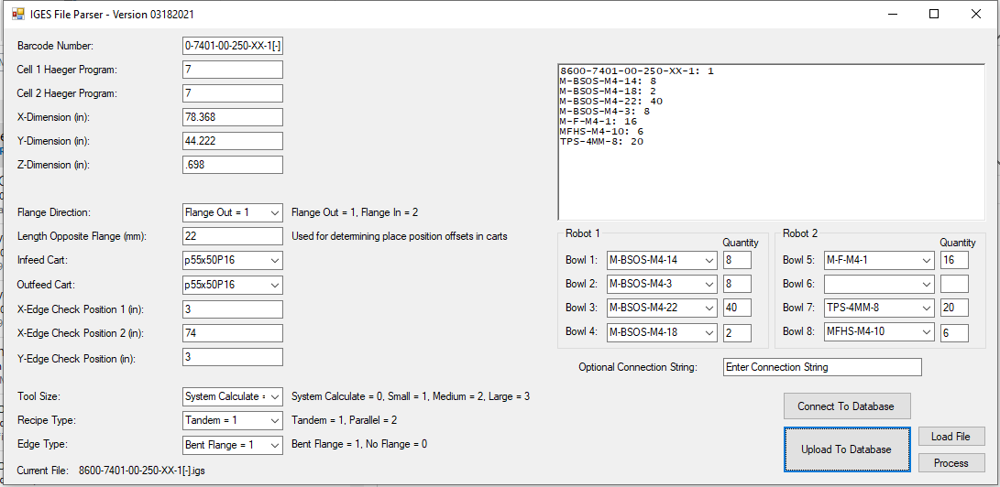
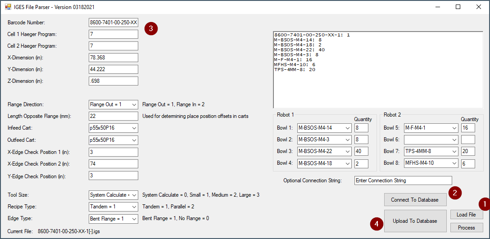
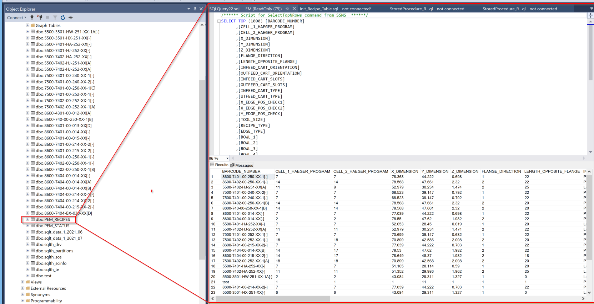
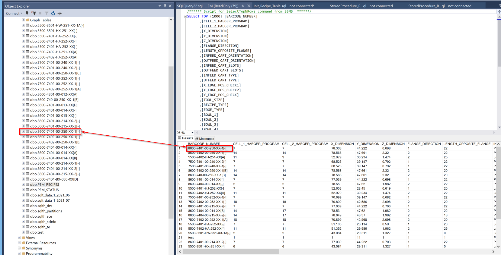
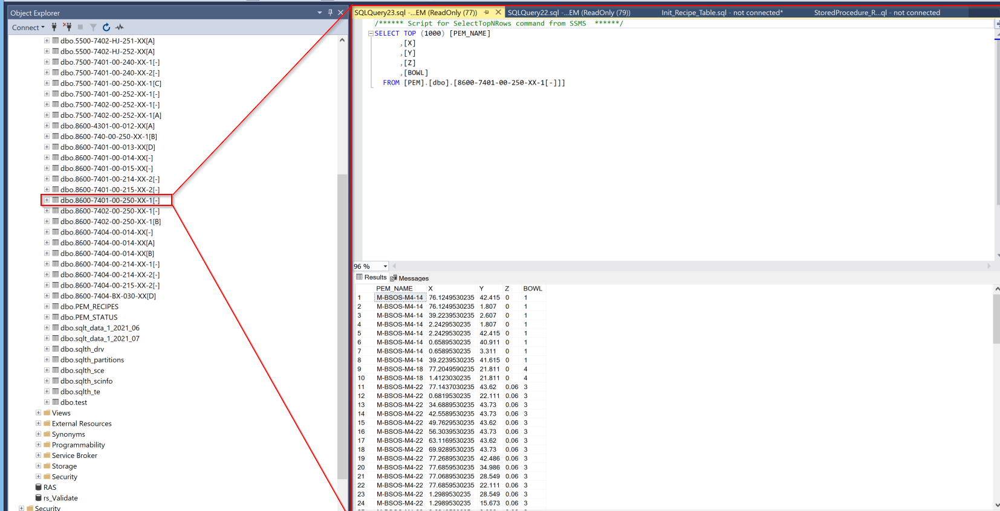

# IGES FILE UPLOADER

This application parses IGES Files and Uploads them to the PEM Database for use with the PEM Robot. 
Previous version only exported .csv. This functionality is deprecated but still available for reference.

# Files
This Folder contains the example .iges files and generated .csv

## EXAMPLE

## USAGE

## Database
PEM_RECIPES TABLE Containing the parameters of the the PEM Robot Recipe

The connection between the Parameter row and its corresponding Postion Table

Position Table containging the XYZ coordinates of each PEM 

